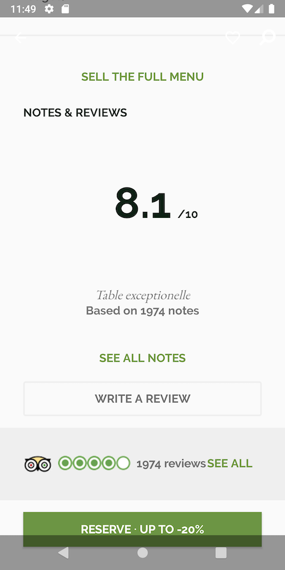

# Clean restaurant
Challenge para the fork , tiene  clean code, coroutines, architecture components, koin, moshi

Usa API the fork

https://api.lafourchette.com/api?%20key=IPHONEPRODEDCRFV&method=restaurant_get_info&id_restaurant=6861
actualizacion 2021: cambio el json del enpoint. Para no actualizar, toma el json de un string con los datos de 2019

